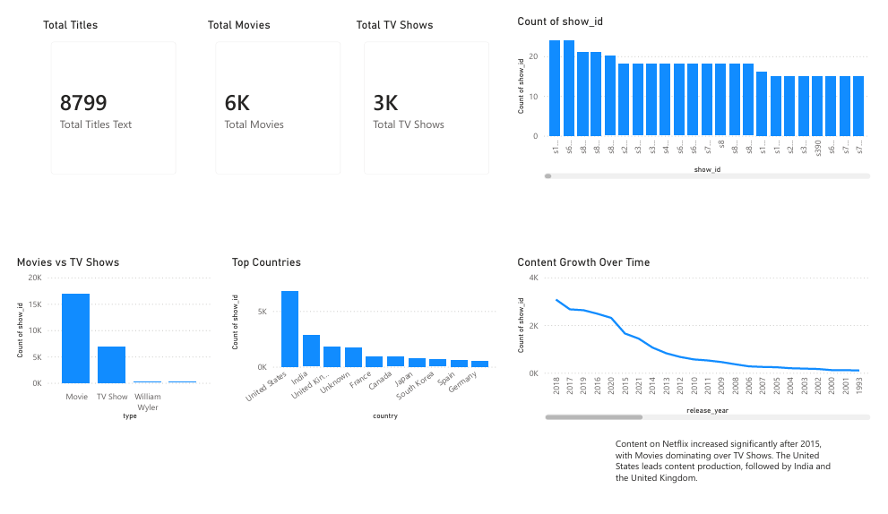

# Netflix Data Analysis Dashboard 📊

## 📌 Overview
This project analyzes Netflix content using Python and Power BI. It focuses on understanding content trends, distribution, and patterns.

## 🛠️ Tools Used
- Python (Pandas, NumPy)
- Power BI

## 📊 Dashboard Preview

## 🔍 Key Insights
- Content increased rapidly after 2015
- Movies dominate over TV Shows
- United States produces the most content
- Top genres include International Movies and Drama

## 📁 Files
- netflix-dashboard.pbix
- cleaned_netflix.csv

## 🚀 Project Highlights
- Data Cleaning using Python
- Exploratory Data Analysis (EDA)
- Interactive Dashboard using Power BI
